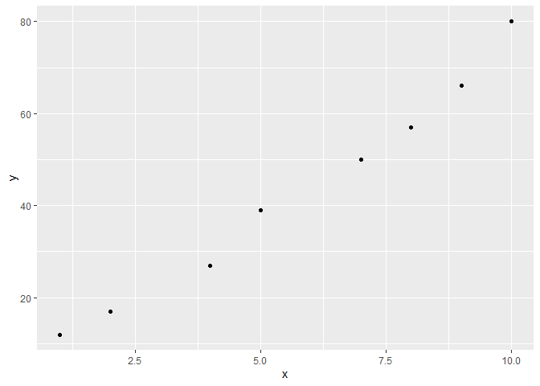
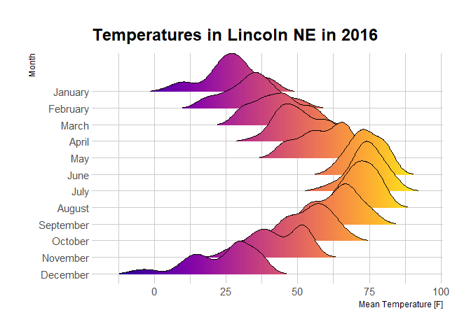

Very Interesting Document
================
Robert
2022-10-31

Hello World

Eat more beans!

``` r
# Addition
7+3
```

    ## [1] 10

``` r
# Subtraction
7-3
```

    ## [1] 4

``` r
# Multiplication
8*7
```

    ## [1] 56

``` r
#Division
100/50
```

    ## [1] 2

``` r
# Square root
sqrt(81)
```

    ## [1] 9

``` r
# Exponents
9^2
```

    ## [1] 81

Simple graph

``` r
#load ggplot2
library(ggplot2)
```

    ## Warning: package 'ggplot2' was built under R version 4.2.2

``` r
#create data frame
df <- data.frame(x=c(1, 2, 4, 5, 7, 8, 9, 10),
                 y=c(12, 17, 27, 39, 50, 57, 66, 80))

#create scatterplot of x vs. y
ggplot(df, aes(x=x, y=y)) +
  geom_point()
```

<!-- -->

Density Plot

``` r
# library
library(ggplot2)
library(dplyr)
```

    ## Warning: package 'dplyr' was built under R version 4.2.2

    ## 
    ## Attaching package: 'dplyr'

    ## The following objects are masked from 'package:stats':
    ## 
    ##     filter, lag

    ## The following objects are masked from 'package:base':
    ## 
    ##     intersect, setdiff, setequal, union

``` r
# Stacked density plot:
p <- ggplot(data=diamonds, aes(x=price, group=cut, fill=cut)) +
    geom_density(adjust=1.5, position="fill") 
#p
```

Ridge Lines

``` r
# library
library(ggridges)
library(ggplot2)
library(viridis)
```

    ## Loading required package: viridisLite

``` r
library(hrbrthemes)
```

    ## NOTE: Either Arial Narrow or Roboto Condensed fonts are required to use these themes.

    ##       Please use hrbrthemes::import_roboto_condensed() to install Roboto Condensed and

    ##       if Arial Narrow is not on your system, please see https://bit.ly/arialnarrow

``` r
# Plot
ggplot(lincoln_weather, aes(x = `Mean Temperature [F]`, y = `Month`, fill = ..x..)) +
  geom_density_ridges_gradient(scale = 3, rel_min_height = 0.01) +
  scale_fill_viridis(name = "Temp. [F]", option = "C") +
  labs(title = 'Temperatures in Lincoln NE in 2016') +
  theme_ipsum() +
    theme(
      legend.position="none",
      panel.spacing = unit(0.1, "lines"),
      strip.text.x = element_text(size = 8)
    )
```

    ## Picking joint bandwidth of 3.37

    ## Warning in grid.Call(C_stringMetric, as.graphicsAnnot(x$label)): font family not
    ## found in Windows font database

    ## Warning in grid.Call(C_stringMetric, as.graphicsAnnot(x$label)): font family not
    ## found in Windows font database

    ## Warning in grid.Call(C_stringMetric, as.graphicsAnnot(x$label)): font family not
    ## found in Windows font database

    ## Warning in grid.Call(C_textBounds, as.graphicsAnnot(x$label), x$x, x$y, : font
    ## family not found in Windows font database

    ## Warning in grid.Call(C_textBounds, as.graphicsAnnot(x$label), x$x, x$y, : font
    ## family not found in Windows font database

    ## Warning in grid.Call(C_textBounds, as.graphicsAnnot(x$label), x$x, x$y, : font
    ## family not found in Windows font database

    ## Warning in grid.Call(C_textBounds, as.graphicsAnnot(x$label), x$x, x$y, : font
    ## family not found in Windows font database

    ## Warning in grid.Call(C_textBounds, as.graphicsAnnot(x$label), x$x, x$y, : font
    ## family not found in Windows font database

    ## Warning in grid.Call(C_textBounds, as.graphicsAnnot(x$label), x$x, x$y, : font
    ## family not found in Windows font database

    ## Warning in grid.Call(C_textBounds, as.graphicsAnnot(x$label), x$x, x$y, : font
    ## family not found in Windows font database

    ## Warning in grid.Call(C_textBounds, as.graphicsAnnot(x$label), x$x, x$y, : font
    ## family not found in Windows font database

    ## Warning in grid.Call(C_textBounds, as.graphicsAnnot(x$label), x$x, x$y, : font
    ## family not found in Windows font database

    ## Warning in grid.Call(C_textBounds, as.graphicsAnnot(x$label), x$x, x$y, : font
    ## family not found in Windows font database

    ## Warning in grid.Call.graphics(C_text, as.graphicsAnnot(x$label), x$x, x$y, :
    ## font family not found in Windows font database

    ## Warning in grid.Call(C_textBounds, as.graphicsAnnot(x$label), x$x, x$y, : font
    ## family not found in Windows font database

<!-- -->

THere is no working code.
